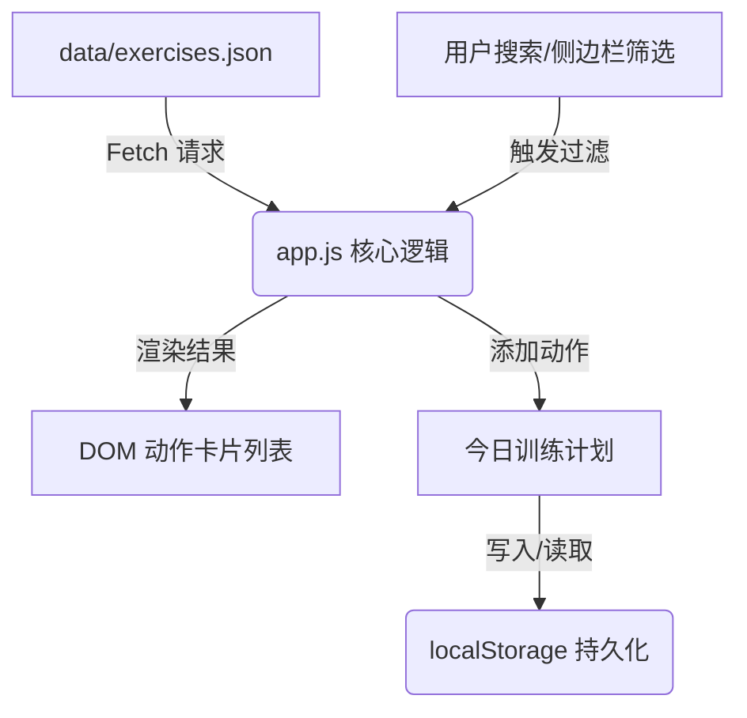

# Spec - 健身动作浏览器与计划制定器技术规格书

本技术规格书定义了 FitGuide 健身应用的实现细节。

## 1. 架构设计与核心逻辑
本应用采用纯静态、单页面应用（SPA）架构，使用原生 HTML5、CSS3 和 JavaScript 开发，保证极速的加载性能与跨设备兼容性。

### 1.1 数据流动关系

## 2. 界面设计规范 (UI/UX)
遵循运动科技与现代暗黑风设计规范：
* **主色调**：深灰背景（`#0d0e12`），卡片背景（`#16171f`，带 `#ffffff05` 半透明边框）。
* **强调色**：霓虹紫渐变（`#7c3aed` 到 `#4f46e5`）。
* **字体**：系统默认无衬线字体，配合 `Inter` 或 `Outfit`。
* **自适应布局**：
  - PC 端：侧边筛选栏固定在左侧，主内容区采用 `grid` 网格自适应排列动作卡片。
  - 手机端：侧边筛选栏收起为底部/顶部弹出式抽屉，卡片调整为单列卡片展示，优化点击区域。

## 3. 功能点规格说明
1. **高性能分页/惰性渲染**：由于动作总数有 1324 个，一次性渲染 DOM 会导致页面卡顿。页面将采用分页加载（初次加载 20 个，向下滚动时自动加载更多）。
2. **多重交叉检索**：支持搜索词模糊匹配（动作名/目标肌群） + 身体部位（单选） + 器械（多选）的交叉过滤。
3. **今日计划功能**：
   - 动作卡片上提供“加入计划”按钮。
   - 提供一个独立面板展示当前计划的动作列表。
   - 支持一键清空、删除单个动作。
   - 提供“导出到 Obsidian”功能：将当前计划转换为 Markdown 列表并复制到剪贴板。
4. **PWA 离线支持**：
   - 配置 `manifest.json` 支持“添加到主屏幕”。
   - 编写 `sw.js` 实现对页面静态文件和 17MB `exercises.json` 的本地强缓存，保障离线在健身房断网时可用。

## 4. 部署规划 (Option B)
* 用户可通过在终端运行 `npx -y vercel` 或将其推送至 GitHub 启用 GitHub Pages 服务，直接获得一个 HTTPS 协议的移动端网址，方便手机扫码使用。
